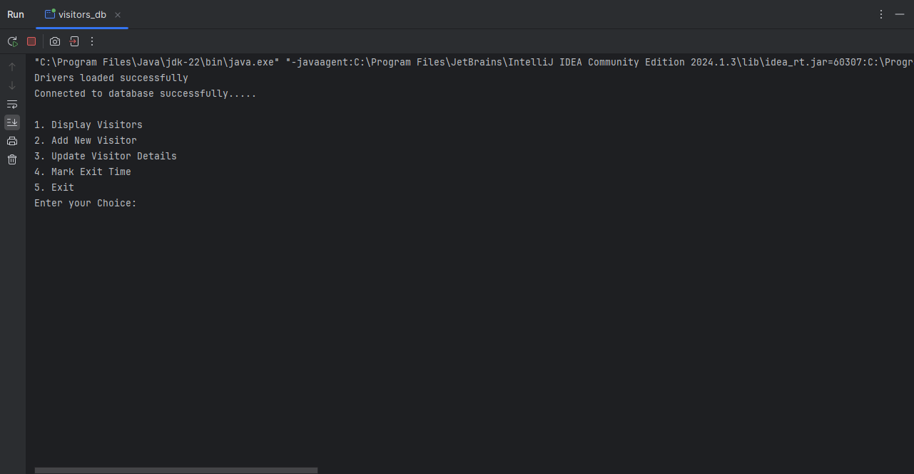
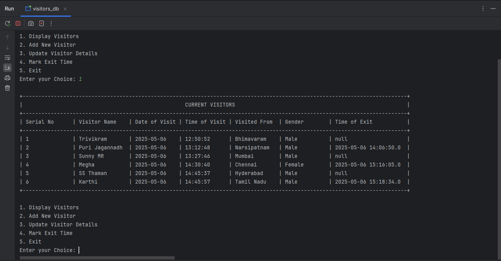
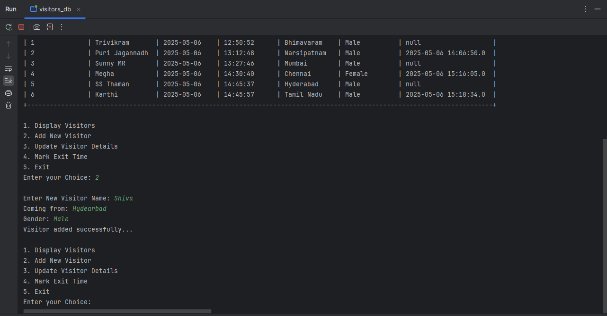
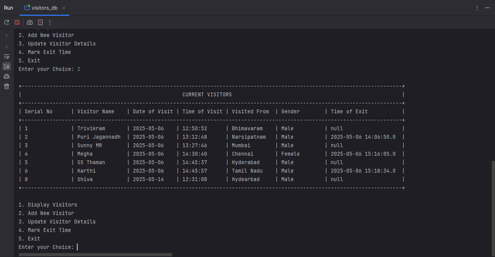
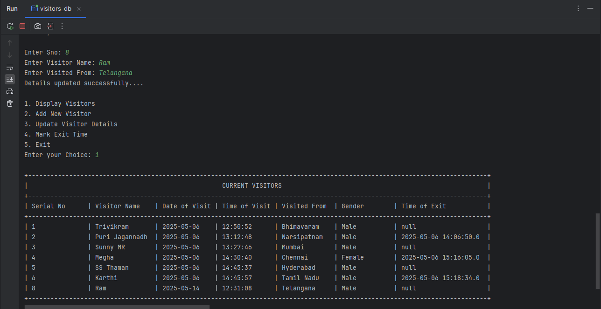
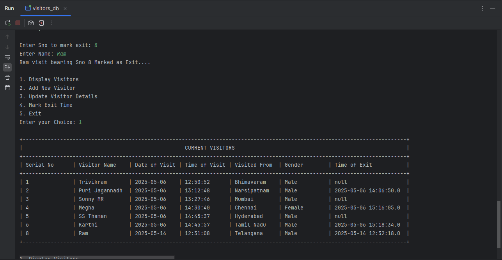

# VisitTrack (Java + MySQL)

VisitorLog is a Java-based console application that helps track and manage visitor entries using a MySQL database. Designed for use in offices, institutions, or any space with regular foot traffic, VisitTrack provides a simple way to record guest details, update visitor info, and mark exit times — all from a terminal interface. It ensures visitor data is organized, timestamped, and accessible for future reference.

## 📋 Features

- View all current and past visitors
- Add new visitor details
- Update existing visitor information
- Mark visitor exit time
- Exit the system safely


## 🛠️ Prerequisites

- Java JDK 8 or higher
- MySQL Server
- MySQL JDBC Driver (`mysql-connector-java`)
- An IDE or terminal to compile and run Java programs


## 📂 Database Setup

1. **Create a database:**

```sql
CREATE DATABASE students;
```

2. **Use the database:**

```sql
USE students;
```

3. **Create the visitors table:**
```sql
CREATE TABLE visitors (
    Sno INT AUTO_INCREMENT PRIMARY KEY,
    Name VARCHAR(100) NOT NULL,
    visited_from VARCHAR(100),
    Gender VARCHAR(10),
    Date_of_visit DATE,
    Time_of_visit TIMESTAMP DEFAULT CURRENT_TIMESTAMP,
    Time_of_Exit TIMESTAMP NULL
);
```

## 🔧 Configuration
Update the following database credentials in your Java code
```java
String url = "jdbc:mysql://localhost:3306/students";
String username = "root";
String password = "your_mysql_password_here";
```

## ▶️ How to Run

1. **Compile the Java Program:**
```java
   javac visitors_db.java
```
2. **Run the Program:**
```java
   java visitors_db
``` 
3. **Follw the on-screen menu to perform actions:**
```java
1. Display Visitors
2. Add New Visitor
3. Update Visitor Details
4. Mark Exit Time
5. Exit
```
## 🖼️ Screenshots
### Main Page


### Displaying Visitors from log


### Adding New Visitor


### Displaying Visitors after new Record


### Updating Existing Records


### Marking Exit Time (Visitor "Ram" Maked as Exit)


